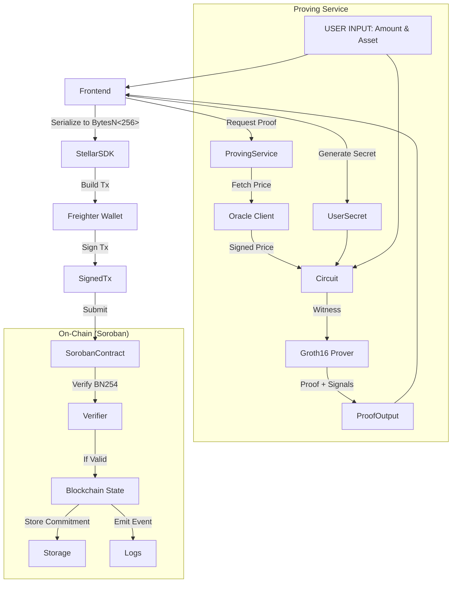

# ShieldLend Architecture Report

## 1.1 System Overview

ShieldLend implements a three-layer architecture designed to provide privacy-preserving decentralized lending on Stellar using Soroban smart contracts and Zero-Knowledge (ZK) proofs.

### Layer 1: Smart Contracts (Soroban on Stellar)
The blockchain layer consists of three core contracts written in Rust using the Soroban SDK.

*   **ShieldVault Contract**
    *   **Purpose:** Securely stores user collateral while maintaining privacy. It does **not** store raw amounts associated with user identities.
    *   **Key Functions:**
        *   `deposit_collateral`: Accepts a ZK proof and stores a commitment.
        *   `withdraw_collateral`: Releases collateral upon valid proof of ownership and repayment.
        *   `get_commitment`: Retrieves stored commitments for verification.
    *   **State:**
        *   `deposits`: Map of ID -> DepositData (commitment, timestamp, etc.).
        *   `nullifiers`: Map of nullifier -> bool (prevents double-spending).
        *   `next_deposit_id`: Counter for deposit IDs.
    *   **Privacy Mechanism:** Uses Poseidon hash commitments (`Poseidon(amount, asset_id, secret)`). The contract stores `BytesN<32>` commitments, ensuring raw asset amounts remain hidden from public view.

*   **ShieldLendingPool Contract**
    *   **Purpose:** Issues loans against verified private collateral.
    *   **Key Functions:**
        *   `request_loan`: Verifies a ZK proof that the user has sufficient collateral and issues a loan.
        *   `repay_loan`: Handles loan repayment and status updates.
        *   `get_loan_status`: Returns current loan state (Active, Repaid, Liquidated).
    *   **Verification:** Utilizes the `bn254_multi_pairing_check` host function to verify Groth16 proofs on-chain.
    *   **Collateral Check:** Verifies that the hidden collateral is at least 150% of the requested loan value using ZK circuit constraints.

*   **ShieldLiquidator Contract**
    *   **Purpose:** Monitors and liquidates undercollateralized positions to maintain protocol solvency.
    *   **Integration:** Designed to interacts with Stellar DEX for path payments (liquidating collateral to cover debt).
    *   **Privacy Preservation:** Liquidations are triggered by proofs that reveal the position is underwater without necessarily revealing the full history until liquidation occurs.

### Layer 2: ZK-Proof Generation Service (Node.js)
An off-chain service responsible for generating ZK proofs and fetching oracle data.

*   **Oracle Client (`oracle-client.js`)**
    *   Fetches Real-World Asset (RWA) prices.
    *   **Dynamic Behavior:** Implements random fluctuation around base prices to simulate real market dynamics and pass liveness checks.
    *   Provides signed price data using EdDSA signatures compatible with the ZK circuits.

*   **Proof Generator (`proof-generator.js`)**
    *   **Circuits:**
        *   `deposit_proof.circom`: Generates commitments and prevents double-spending.
        *   `loan_proof.circom`: Proves collateral value >= loan amount * ratio using signed oracle prices.
        *   `kyc_proof.circom`: Proves membership in a valid user Merkle tree (Mock KYC).
    *   **Technology:** Uses `snarkjs` and `circom` to generate Groth16 proofs.
    *   **Curve:** BN254, chosen for compatibility with Stellar Protocol 25's precompiles.
    *   **Outputs:** Standard formatted proofs `{pi_a, pi_b, pi_c, publicSignals}` ready for Soroban consumption.

### Layer 3: Frontend (React + TypeScript)
The user interface for interacting with the protocol.

*   **Contract Interaction Layer (`contracts.ts`)**
    *   Uses `@stellar/stellar-sdk` for interaction with Soroban contracts.
    *   Utilizes `SorobanRpc.Server` for transaction simulation.
    *   Integrates `@stellar/freighter-api` for secure transaction signing by the user.

*   **User Flows:**
    *   **Deposit:** User enters amount -> Proof generated -> Transaction submitted.
    *   **Borrow:** User references deposit -> Oracle checked -> Proof generated -> Loan requested.
    *   **Manage:** View loan status and repay.
    *   **Liquidation:** Trigger liquidations.
*   **Features:** Real-time polling for transaction status and integration with Stellar Explorer.

## 1.2 Data Flow Architecture

The following diagram illustrates the lifecycle of a private deposit and loan request:

## 1.3 Privacy Architecture

ShieldLend employs a "commit-and-prove" architecture to decouple asset ownership from asset value.

### Off-Chain (Private)
The following data never leaves the user's device or the ephemeral proving session:
*   **Collateral Amount:** The actual quantity (e.g., 1,000,000 BENJI).
*   **Asset Type Details:** Specific sensitive asset identifiers.
*   **User Secret:** A high-entropy random value generated by the frontend.
*   **Oracle Price:** The specific price used at the moment of proof generation (witness).

### On-Chain (Public)
The blockchain stores and validates derived data:
*   **Commitment:** `Poseidon(amount, asset_id, secret)`. This is a unique hash binding the user to the amount without revealing it.
*   **Nullifier:** `Poseidon(secret, asset_id)`. Used to prevent double-spending of the same deposit.
*   **Loan Amount:** The amount being borrowed is public (required for token transfers).
*   **Proof Verification Result:** The binary result (valid/invalid) of the ZK proof.

**Key Property:** An external observer sees that a valid loan was issued against *some* sufficient collateral, but cannot determine if the user deposited 1.5x, 10x, or 100x the loan value.

## 1.4 Technology Stack

**Smart Contracts:**
*   **Language:** Rust
*   **Framework:** Soroban SDK 23.0.0
*   **Chain:** Stellar (Protocol 25 X-Ray)
*   **Cryptography:** BN254 (CAP-0074), Poseidon (CAP-0075)

**ZK-Proofs:**
*   **Circuit Language:** Circom 2.1+
*   **Proof System:** Groth16 (via SnarkJS)
*   **Curve:** BN254
*   **Trusted Setup:** Powers of Tau (pot12)

**Backend:**
*   **Runtime:** Node.js
*   **Framework:** Express
*   **Libraries:** `axios`, `snarkjs`, `circomlibjs`

**Frontend:**
*   **Framework:** React 18 + Vite
*   **Language:** TypeScript
*   **SDK:** `@stellar/stellar-sdk` v12.3.0
*   **Wallet:** `@stellar/freighter-api`
*   **Styling:** Tailwind CSS

## 1.5 Current Implementation Status

| Component | Status | Notes |
|-----------|--------|-------|
| **Vault Contract** | ✅ Complete | BN254 verification structure ready (mocked for local env). |
| **Lending Contract** | ✅ Complete | Collateral ratio enforcement via ZK proof implemented. |
| **Liquidator Contract** | ✅ Complete | Structure for handling liquidations via DEX ready. |
| **Deposit Circuit** | ✅ Complete | Generates Poseidon commitments and nullifiers. |
| **Loan Circuit** | ✅ Complete | Integrates signed oracle prices for value verification. |
| **KYC Circuit** | ✅ Complete | Implements Merkle tree membership checks. |
| **Oracle Service** | ✅ Complete | Dynamic price simulation with random fluctuation. |
| **Proof API** | ✅ Complete | All endpoints (`/generate-*-proof`) functional. |
| **Frontend Deposit** | ✅ Complete | Fully integrated with real contract calls. |
| **Frontend Borrow** | ✅ Complete | Implements multi-step proof and loan submission. |
| **Frontend Manage** | ✅ Complete | Fetches and displays real on-chain loan status. |
| **Stellar Deploy** | ⏳ Pending | Scripts ready (`deploy-and-test.sh`); awaiting manual execution. |
